# Villager — Visual Plan

This document uses simple diagrams to make the Villager system easier to reason about.

Use this as the “picture version” of:
- `architecture-plan.md`
- `schemas.md`
- `run-lifecycle.md`

---

# 1. System view

## Big picture

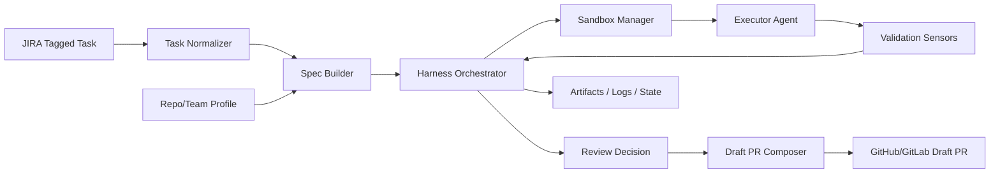

## Read it like this
- JIRA gives the work
- normalization cleans the task
- spec builder turns it into bounded work
- harness controls the run
- sandbox gives safe execution
- executor does the coding
- validators check the result
- harness decides retry / human gate / PR draft

---

# 2. Responsibility boundaries

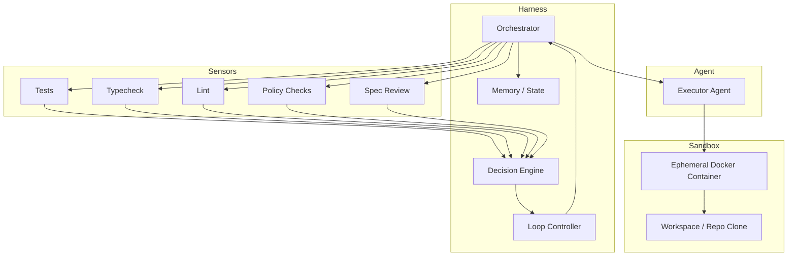

## Key idea
The **agent writes**.
The **harness decides**.
The **sensors judge**.
The **sandbox contains**.

---

# 3. End-to-end happy path

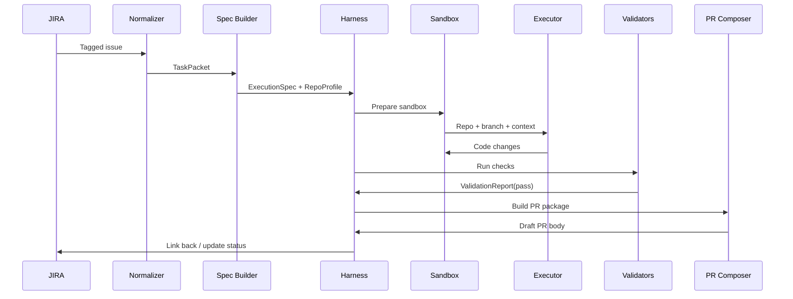

---

# 4. Retry loop visual

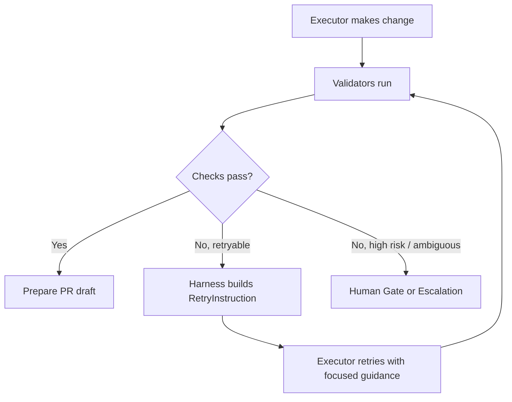

## Core rule
Do not do:
- raw log dump back into model
- infinite repair loop
- self-declared success

Do this instead:
- structured retry instruction
- capped retries
- harness-owned routing

---

# 5. Human gate visual

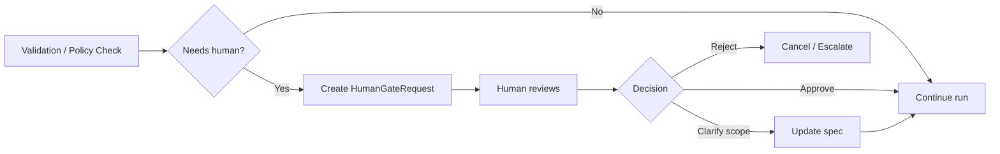

## Trigger examples
- migration needed
- sensitive path touched
- ambiguous acceptance criteria
- retry cap exceeded
- risky diff too large

---

# 6. State machine visual

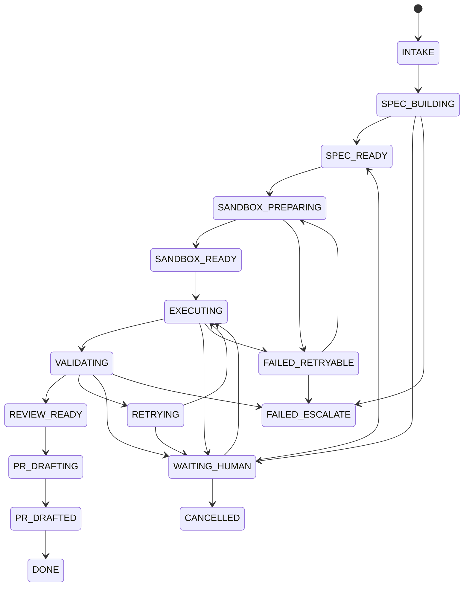

---

# 7. Data objects through the flow

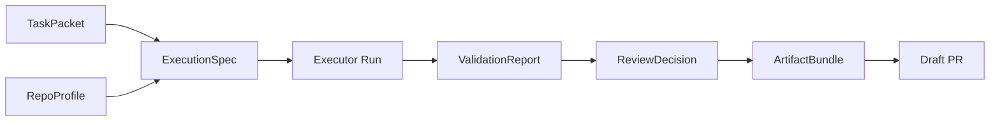

## Meaning
- `TaskPacket` = normalized work intake
- `RepoProfile` = personalization layer
- `ExecutionSpec` = bounded contract for execution
- `ValidationReport` = evidence from sensors
- `ReviewDecision` = harness routing output
- `ArtifactBundle` = final exported package

---

# 8. Personalization model visual

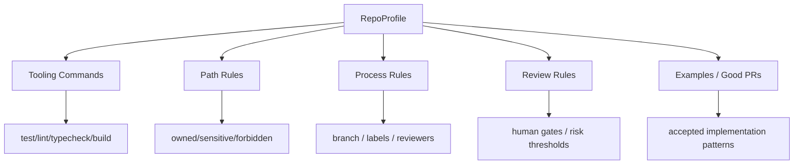

## Why this matters
Personalization is not just “extra prompt context.”
It is operational behavior.

---

# 9. Sandbox run visual

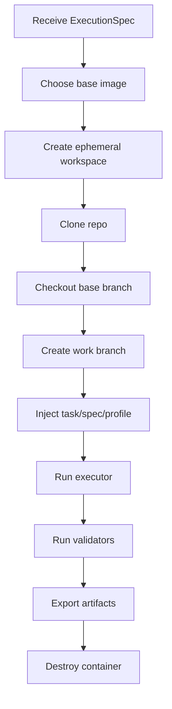

## Important properties
- ephemeral
- reproducible
- resource-bounded
- no persistent state inside container
- all evidence exported before teardown

---

# 10. Trust model visual

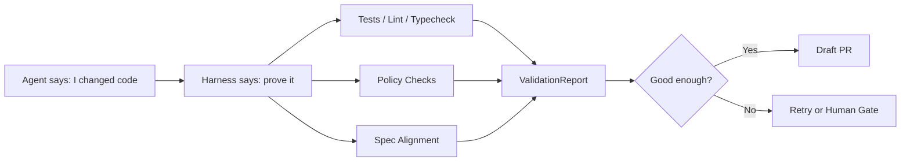

## This is the product
Not just “AI writes code.”
The real product is:
**AI work that can be trusted enough to review quickly.**

---

# 11. Minimal v1 visual

If you want the simplest possible first implementation, think of it like this:

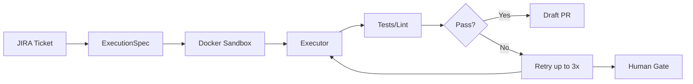

## That is enough for v1
Do not overbuild before this runs.

---

# 12. Recommended operator dashboards later

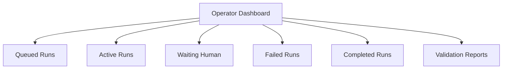

This is not required for day 1, but useful for operating the system once multiple runs exist.

---

# 13. Main design insight

If you remember only one visual, remember this:

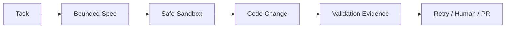

That is Villager in one line.

---

# 14. What to discuss next

Now that the flow is visual, the highest-value follow-up discussions are:

1. **Where exactly does spec generation happen?**
2. **What does the first RetryInstruction schema look like?**
3. **How should human gate UX work?**
4. **What is the minimum sandbox bootstrap contract?**
5. **What are the first repo profile fields to support in code?**

---

# 15. Recommended next artifact

Best next file:

**`diagrams/system-sequence.mmd`** and maybe separate Mermaid files per diagram.

Why:
- easier to edit than one long markdown file
- can be rendered in docs or CI later
- keeps architecture visuals reusable
